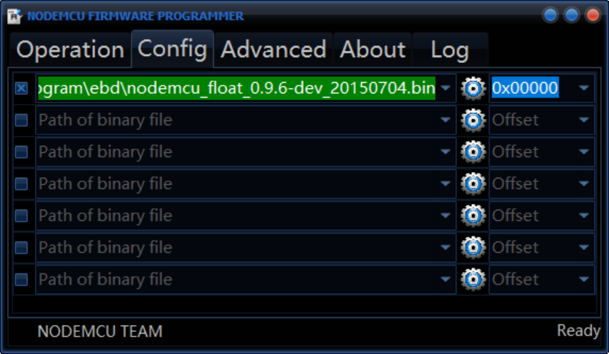
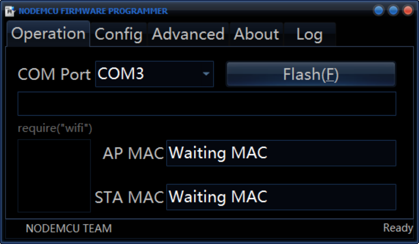
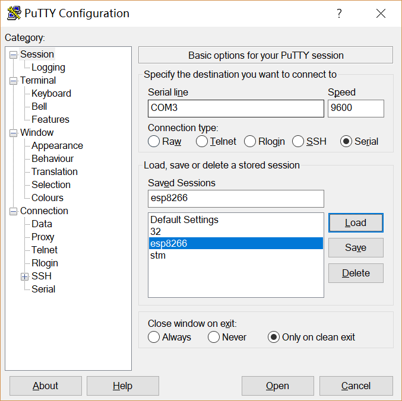
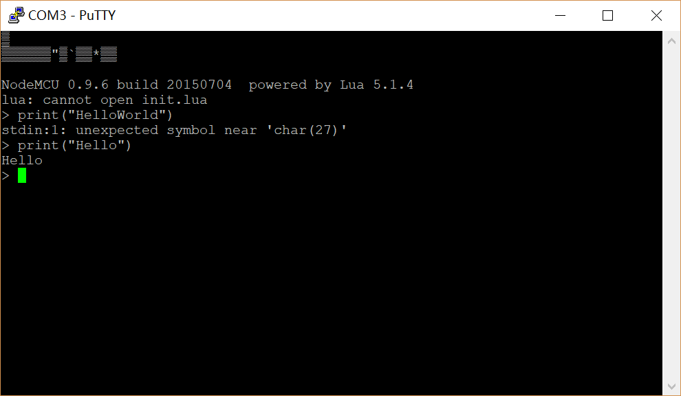
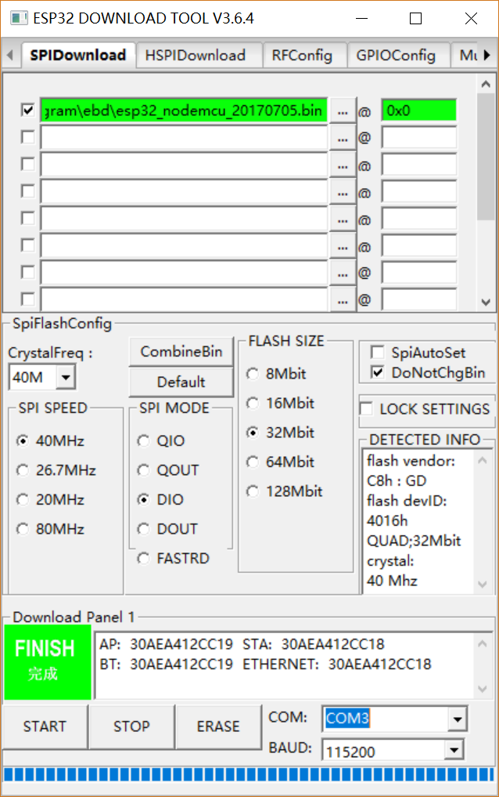
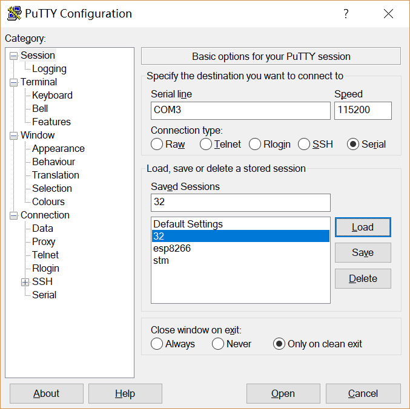
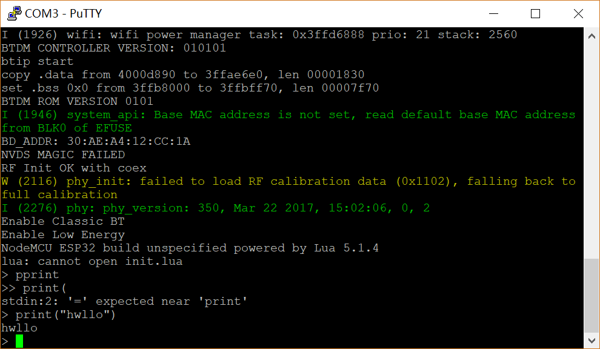

# 烧录Lua解释器-Windows
## 要求
如何在Windows下向ESP8266/ESP32中烧录Lua解释器
## 方法
nodemcu是一个可以运行在esp8266和esp32上的基于eLua的开源平台。我们只需要输入nodemcu固件即可在esp8266/esp32上运行lua解释器
### for esp8266
1. 下载[nodemcu固件 for esp8266](https://github.com/nodemcu/nodemcu-firmware/releases)
可以直接下载编译好的.bin文件，也可以下载源码自己编译，但是编译需要Linux环境，所以我选择直接下载.bin文件
2. 下载[esp8266的nodemcu flash软件](https://github.com/nodemcu/nodemcu-flasher)
3. 用microusb连接esp8266
3. 打开nodemcu flasher，选择刚才下载的.bin文件

4. 选择串口，点击flash就开始刷入固件了，等待一会儿就刷入结束了

5. 用putty连接测试

6. 观察到lua解释器执行了，输入print语句，可以成功打印，说明lua解释器烧录成功

### for esp32
1. 在[这里](http://wiki.ai-thinker.com/esp32/sdk) 下载nodemcu for esp32的固件
2. 下载 [esp32 的烧录工具](https://www.espressif.com/zh-hans/support/download/other-tools)
3. 用microusb连接esp32
4. 打开烧录工具，选择esp32下载工具，设置如下, 点击绿色按钮开始输刷入，刷入时间较长

5. 刷入结束后，用putty连接esp32(注意波特率要设置115200，9600会乱码)

6. 按下en键，观察到lua解释器执行了，输入print语句（这里是没有回显的，得敲下回车才能看到输入），可以成功打印，说明lua解释器烧录成功
